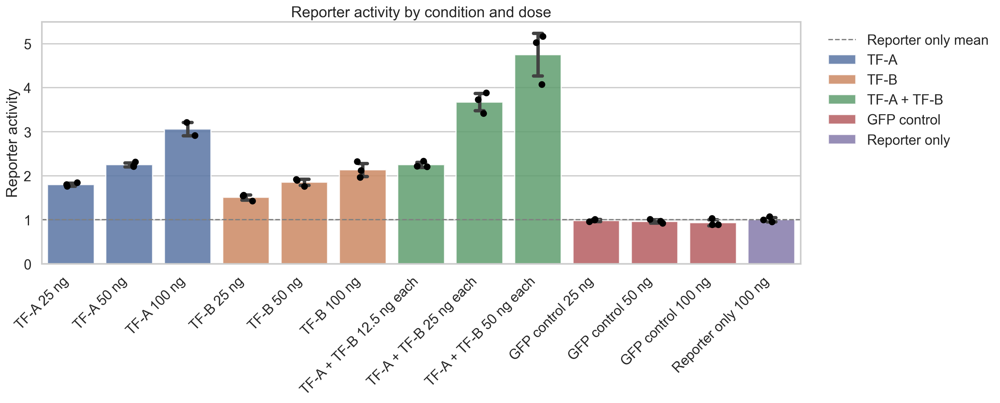
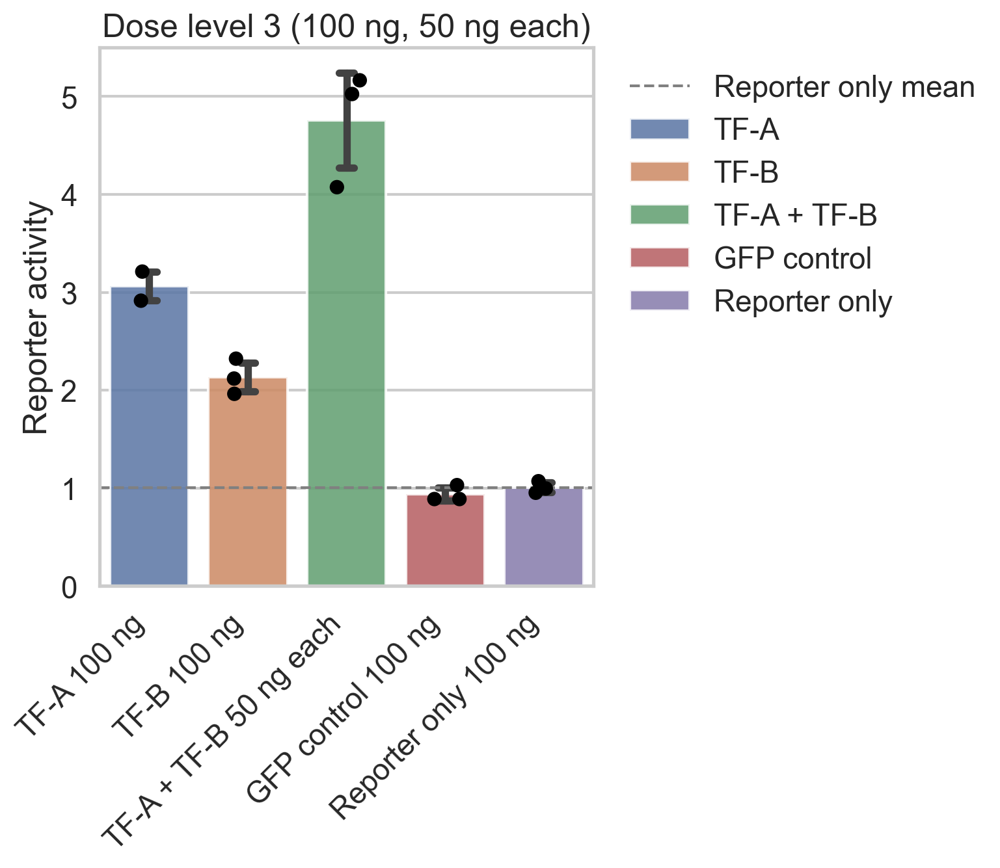

# Reporter Assay Analysis

A Jupyter notebook that turns a reporter assay spreadsheet (e.g. a luciferase assay) into tidy data, summary statistics, statistical tests and clear plots with every replicate shown.

I originally wrote this to help a biology PhD student analyze transcription factor reporter assays, then generalized it so it works with any spreadsheet in the same layout.



## What it does

1. **Loads and cleans** a spreadsheet with a two-row header (condition name + dose), converts values to numbers and reshapes the data to long format
2. **Summarizes** each condition/dose: mean, standard deviation, number of replicates and fold change vs. a baseline condition
3. **Plots**
   - bar chart (mean ± SD) of all conditions with replicate points overlaid
   - boxplot of replicate distributions
   - side-by-side comparison of all conditions at each dose level (low / medium / high), including combinations like `12.5 ng each`
4. **Tests** each condition against the baseline with Welch's t-test
5. **Exports** tidy data, summary and statistics to CSV and figures to PNG

<p align="center">
  
</p>

## Spreadsheet layout

| Row | Content | Example |
|-----|---------|---------|
| 1 | Condition name, above the first dose column of each condition | `TF-A`, `TF-B`, `TF-A + TF-B`, `GFP control`, `Reporter only` |
| 2 | Dose for each column | `25 ng`, `50 ng`, `100 ng`, `12.5 ng each` |
| 3+ | One row per replicate (blank cells allowed) | `1.80`, `1.84`, `1.76` |

`data/example_reporter_assay.xlsx` contains **synthetic data** generated for demonstration. It is not real experimental data.

## Usage

```bash
pip install -r requirements.txt
jupyter notebook reporter_assay_analysis.ipynb
```

Edit the settings cell at the top:

```python
DATA_FILE = "data/your_assay.xlsx"   # your spreadsheet
BASELINE = "Reporter only"           # reference condition for fold change and statistics
```

Then run all cells. Results are written to `figures/`.

> **Note on statistics:** with 2–3 replicates per group, p-values are rough indicators. For publication, consider a one-way ANOVA with a post-hoc test (e.g. Dunnett's) and multiple-comparison correction.

## Built with

Python · pandas · seaborn · matplotlib · SciPy · Jupyter

## Author

Jose E. Rodriguez Rios
